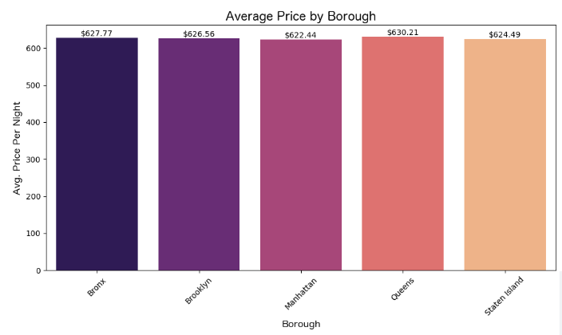
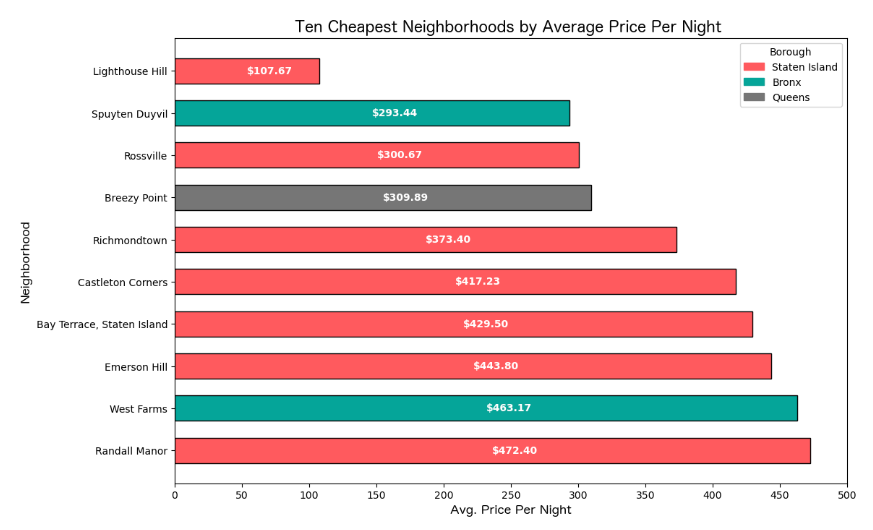
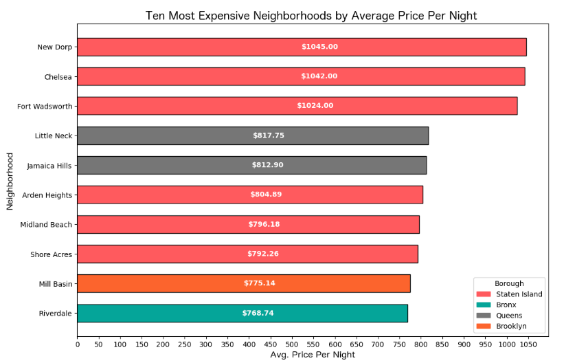
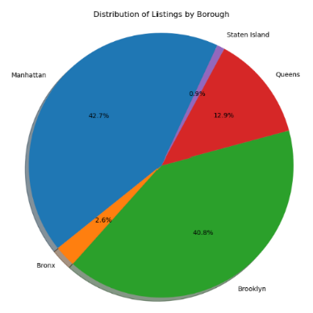
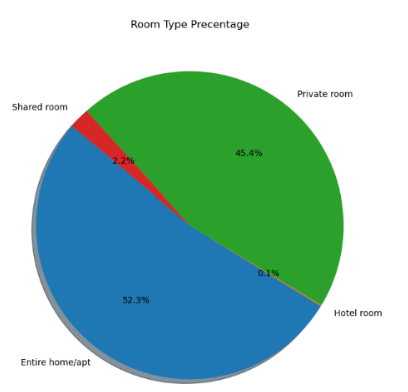
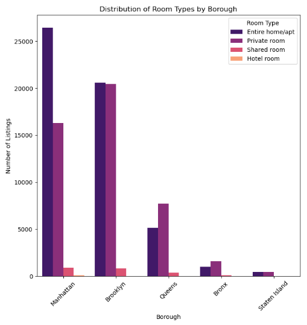
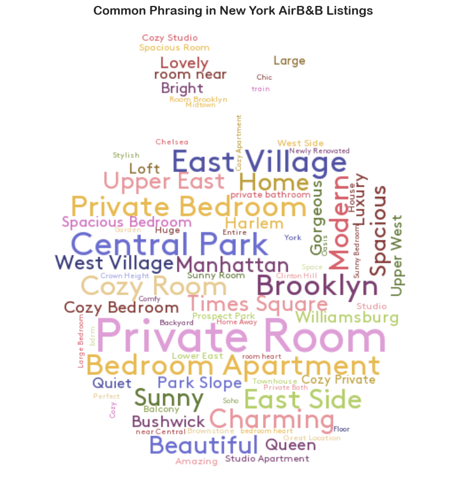
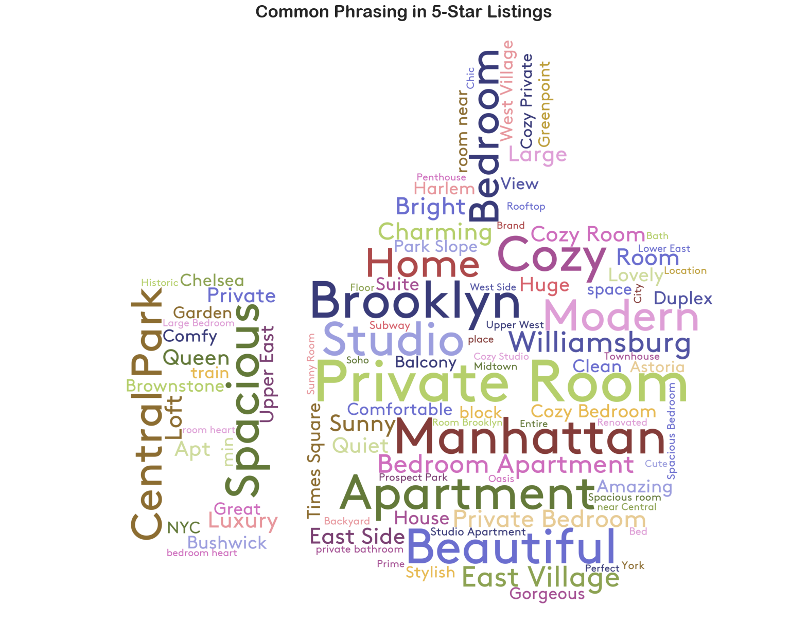
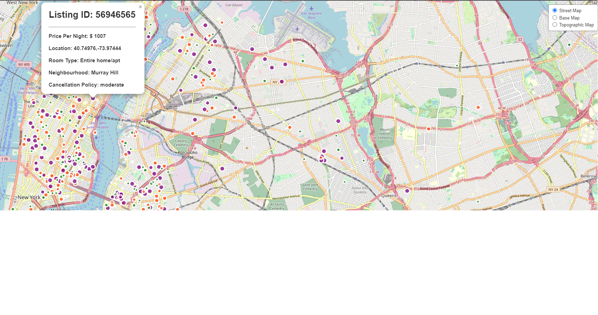

# Project 3 - Group 6

________________________________________________________________________

### PROJECT TITLE : 

New York City Airbnb Listings

________________________________________________________________________
   
### TEAM MEMBERS:

* Jimmy Cowden
* Manroop Gill
* Alysa Schoenfelder
* Ryan Woyce

________________________________________________________________________

### RESEARCH QUESTIONS TO ANSWER:

1. How does pricing vary by neighborhood groups?
2. How does property type vary by borough?
3. What are the most frequently used words in the listings' names?
4. What is the average pricing by property type based on neighborhood along with cancellation policies?

________________________________________________________________________

### DATASET USED:

Airbnb Data: https://www.kaggle.com/datasets/arianazmoudeh/airbnbopendata

_________________________________________________________________________

## ANALYSIS

### 1. How does pricing vary by neighborhood groups?

The average nightly prices across New York City's boroughs found remarkably similar rates. The average price per night for each borough ranged between $622 - $630.
We found that the 10 most expensive neighborhoods ranged from $768 - $1045 and the 10 most affordable ranged $107 - $473 per night. We did notice that neighborhoods in Staten Island
were the majority in the 10 most expensive neighborhoods and also the 10 most affordable neighborhoods - you could find a room for as low as $107 or as high as $1045. Manhattan demonstrated the most consistent nightly rates. 

### 2. How does property type vary by borough?

There were a total of 102,600 listings, Manhattan had the largest number of listings (43,793) and Staten Island had the least (955). The different property types consisted of Entire home/apt, Private room, Shared room, and Hotel room. 
Brooklyn and Manhattan make up 83.5% of all listings, 73.8% of which were private rooms and 82.5% were Entire home/apt.

### 3. What are the most frequently used words in the listings' names?

We developed a word cloud visualization that shows insights into the features or amenities that are often highlighted in Airbnb listings in New York. 
The majority of the listings emphasized "Private Room", and locations/proximity ("Central Park", "East Village", "Brooklyn"). We also looked into common words or phrases that were in listings that were 
rated 5 stars - again, "Private Room" was very emphasized as well as location and description of the listing ("Cozy", "Spacious", "Bright").

### 4. What is the average pricing by property type based on neighborhood along with cancellation policies?

We created an interactive map with 3 views (Street Map, Base Map, Topographic Map) to hover over each listing and see the average pricing, room type, the exact coordinates, and the cancellation policy. 

_________________________________________________________________________

### CONCLUSION

-83% of the listings are found In Manhattan or Brooklyn

-97.7% of the listings are Entire home/apt or Private rooms

-Pricing averages are similar across boroughs, indicating consistency in overall pricing trends.
   Staten Island presents an interesting dynamic where you could potentially find great deals, but you could also end up paying more than in other boroughs

-There are substantial differences in listing counts across the boroughs, reflecting variations in availability and demand.

-Phrasing in listing name shows little to no significant difference, indicating consistency in the way hosts present their properties regardless of rating.

_________________________________________________________________________

